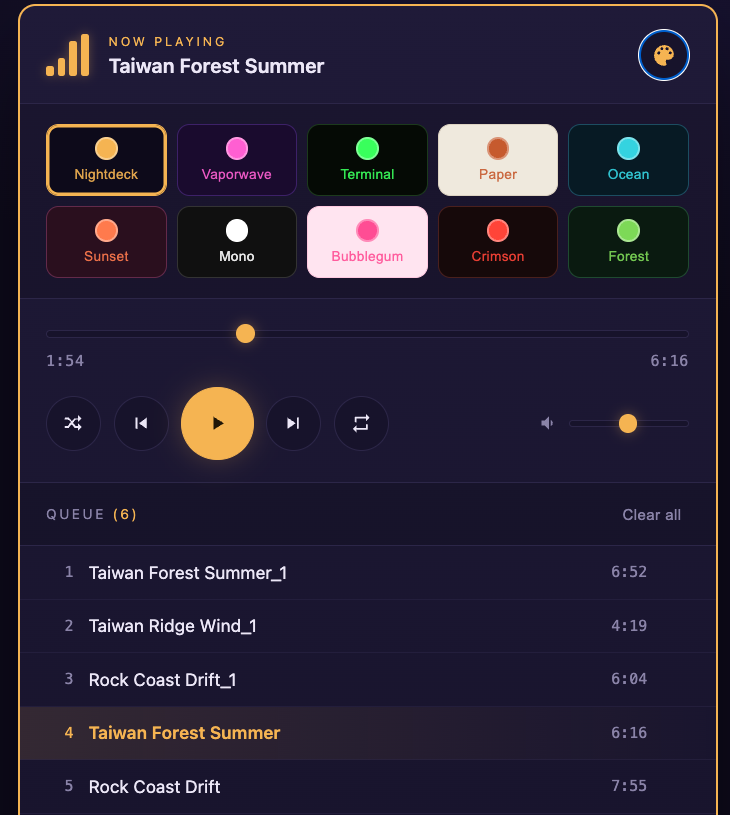

# iLocal Music Player (iLMP) 🎵

A self-contained HTML file that lets you play your own music right in the browser.
**No internet. No installation. No dependencies. Just the magic of JavaScript.**

## Introduction

iLMP is a single `.html` file. Open it in any modern browser, drop in your music, and play. Your files never leave your device — the browser reads them straight off your disk, so nothing is uploaded and nothing is stored after you close the tab.

That's the whole thing. One file. No build step, no server
## Features

- 🎧 **Plays common audio formats** — MP4/M4A, MP3, AAC, OGG, WAV, FLAC, Opus (anything your browser can decode)
- 📂 **Multiple files at once** — add a whole batch by dragging them in or browsing
- 📃 **Playback queue** — click any track to jump to it; auto-advances when one ends
- ⏯️ **Full controls** — play/pause, next/previous, seek, and volume
- 🔀 **Shuffle & repeat**
- 🗑️ **Manage the queue** — remove single tracks or clear all
- ⌨️ **Keyboard shortcut** — press <kbd>Space</kbd> to play/pause
- 🎨 **10 built-in skins** — Nightdeck, Vaporwave, Terminal, Paper, Ocean, Sunset, Mono, Bubblegum, Crimson, Forest
- 🔒 **100% private** — files stay local; no uploads, no tracking, no accounts

## How to use

1. Download `local-music-player.html`.
2. Double-click it (or open it in your browser).
3. Click **+ Add music files**, or drag files onto the player.
4. Hit play. Use the palette button in the top-right corner to change the look.

That's it.

## Browser support

Works in current versions of Chrome, Edge, Firefox, and Safari. Audio playback depends on the codecs your browser supports; standard MP3 and MP4/AAC files play everywhere. If a file has an unusual codec and stays silent, converting it to MP4 (AAC) or MP3 fixes it.

## Privacy

iLMP makes zero network requests. Your music is read locally and is never sent anywhere. Because nothing is saved, closing the tab clears the queue — add your files again next time.

## License

Released under the [MIT License](LICENSE) — free to use, modify, and share.